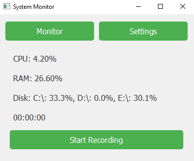
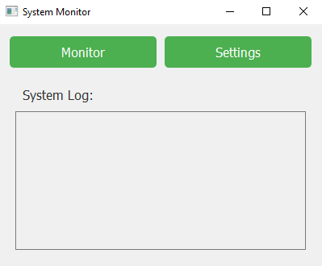

# Система мониторинга ресурсов (System Monitor)

## Описание
Система мониторинга ресурсов — это приложение на Python с использованием библиотеки PySide6 и psutil для отслеживания использования CPU, RAM и дискового пространства. Программа записывает данные в базу данных SQLite и отображает их в графическом интерфейсе.
Проект сделан с 0 от начала создания кода на python до полного релиза! на github за отведенное время 1 час 30 минут!

## Скриншоты

*Главный экран программы, показывающий использование ресурсов.*



*Системный лог с записями мониторинга.*


## Установка

### Требования
* Python 3.7 или выше
* Библиотеки:
    - PySide6
    - psutil
    - sqlite3 (входит в стандартную библиотеку Python)

### Установка зависимостей
1. Склонируйте репозиторий:
    ```bash
    git clone https://github.com/Analo4ka228/Monitoring_info.git
    cd репозиторий 
    ```
   
2. Установите зависимости:
    ```bash
    pip install PySide6 psutil
    ```

## Запуск программы
Для запуска программы используйте следующую команду:
```bash
python MonitoringCPU.py
